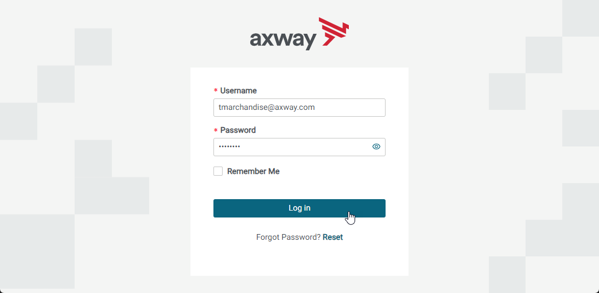
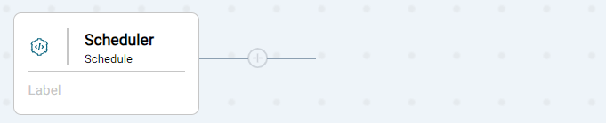
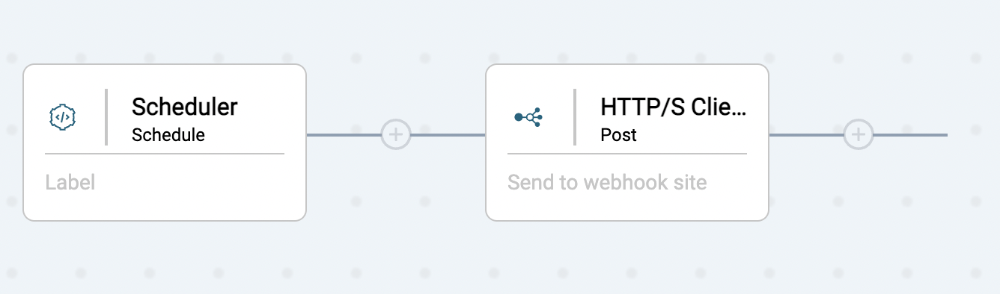
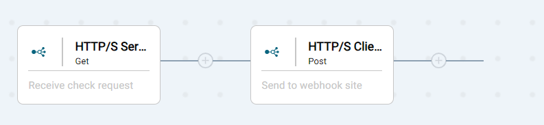

# Hello World Lab Automatation

Here are some instructions to follow to complete the Hello World Lab automatically


## Pre-requisites

* Access to Amplify Integration
  > If you do not have an account and need one, please send an email to **[amplify-integration-training@axway.com](mailto:amplify-integration-training@axway.com?subject=Amplify%20Integration%20-%20Training%20Environment%20Access%20Request&body=Hi%2C%0D%0A%0D%0ACould%20you%20provide%20me%20with%20access%20to%20an%20environment%20where%20I%20can%20practice%20the%20Amplify%20Integration%20e-Learning%20labs%20%3F%0D%0A%0D%0ABest%20Regards.%0D%0A)** with the subject line `Amplify Integration Training Environment Access Request`
* Access to [**Webhook.site**](https://webhook.site/) that you can use to send API requests to for analysis. You can alternatively use an equivalent tool such as [**typedwebhook**](https://typedwebhook.tools/) or others that you may prefer
* Access to the chrome extension `Selenium IDE`. If Selenium IDE is not already installed on your browser, you can download it [**here**](https://chromewebstore.google.com/detail/selenium-ide/mooikfkahbdckldjjndioackbalphokd)

## Lab 1

In this lab, we'll create an integration that is triggered using a Scheduler and test it

* Login into Amplify Integration

  

* Open this ([file](<Lab 1 automated.side>)) in Selenium IDE

* Click on the Run current test button
   (2).png>)

* A green check should appear next to your test's name, indicating that your test was successful
  

Your final integration should look like this:



## Lab 2

In this lab, we'll add an HTTP/S Client component (and associated connection) to our integration and test it.

* Continue from Lab 1 and copy the URL of your integration
 .png>)

* Open this [file](<Lab 2 automated.side>) in Selenium IDE

* Paste the Url in the Open command Target and in the Playback base URL field
 

* Paste url for webhook site (WITHOUT THE `https://` PROTOCOL ) in the Value field of the 27th command
 

* Click on the Run current test button
 

* A green check should appear next to your test's name, indicating that your test was successful
 

* See results in webhook site, the following Json text should appear:
 ```json
  {
    "text": "Hello world"
  ‌}
  ```
  

Your final integration should look like this:



## Lab 3

In this lab, we'll replace the Scheduler component event trigger with an HTTP/S Server component (and associated connection) and test it.

* Continue from Lab 2 and copy the URL of your integration
  

* Paste the Url in the Open command Target and in the Playback base URL field
  

* Click on the Run current test button
  

* A green check should appear next to your test's name, indicating that your test was successful
  

* Back to the integration copy the endpoint URL on the data plane  
  

* In a separate browser tab paste the URL and enter a value for value (e.g. 10)

* See results in webhook site and see that the body is equal to the value you provided
  

Your final integration should look like this:



## Lab 4

In this lab, we'll add some flow control logic and variables to our integration and test it.

* Continue from Lab 3 and copy the URL of your integration
  

* Paste the Url in the Open command Target and in the Playback base URL field
  

* Click on the Run current test button
  

* A green check should appear next to your test's name, indicating that your test was successful
  

* Activate your integration and trigger it with values greater than and less than 10 to see that only those greater than 10 are sent to webhook site. Verify by inspecting the transaction in the Monitor

Your final integration should look like this:


