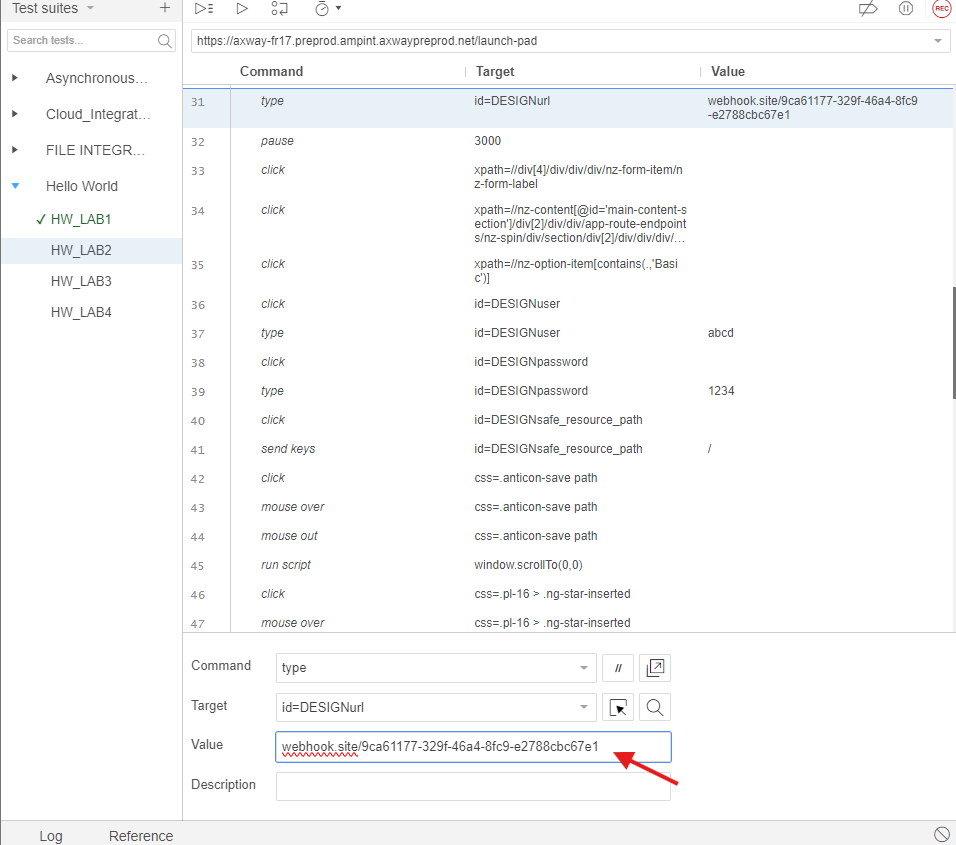

# Hello World Lab Automatation

Here are some instructions to follow to complete the Hello World Lab automatically


## Pre-requisites

* Access to Amplify Integration
  > If you do not have an account and need one, please send an email to **[amplify-integration-training@axway.com](mailto:amplify-integration-training@axway.com?subject=Amplify%20Integration%20-%20Training%20Environment%20Access%20Request&body=Hi%2C%0D%0A%0D%0ACould%20you%20provide%20me%20with%20access%20to%20an%20environment%20where%20I%20can%20practice%20the%20Amplify%20Integration%20e-Learning%20labs%20%3F%0D%0A%0D%0ABest%20Regards.%0D%0A)** with the subject line `Amplify Integration Training Environment Access Request`
* Access to [**Webhook.site**](https://webhook.site/) that you can use to send API requests to for analysis. You can alternatively use an equivalent tool such as [**typedwebhook**](https://typedwebhook.tools/) or others that you may prefer
* Access to the chrome extension `Selenium IDE`. If Selenium IDE is not already installed on your browser, you can download it [**here**](https://chromewebstore.google.com/detail/selenium-ide/mooikfkahbdckldjjndioackbalphokd)

## Lab 1

In this lab, we'll create an integration that is triggered using a Scheduler and test it

* Login into Amplify Integration

  

* Open this ([file](<Tests automatisés.side>)) in Selenium IDE

* Click on the Tests button

  

* Select Test Suites 

  

* Select the Hello World Test list and then select the first Lab

  

* Click on the Run current test button to launch your test
  

A green check should appear next to your test's name, indicating that your test was successful

  

Your final integration should look like this:

  

> Note that it could be better to set your windows as shown below to be able to follow the steps in Selenium IDE and see the execution of your test on Amplify Integration at the same time

  

## Lab 2

In this lab, we'll add an HTTP/S Client component (and associated connection) to our integration and test it.

* Select the Hello World Lab2 test

 

* Before running the test, go the instruction 31 and replace the value by your Webhook.Site URL (without the `HTTPS://` protocol)

  

* Click on the Run current test button

* A green check should appear next to your test's name, indicating that your test was successful
 

* See the results in webhook site, the following Json text should appear:
 ```json
  {
    "text": "Hello world"
  ‌}
  ```
  

Your final integration should look like this:


## Lab 3

In this lab, we'll replace the Scheduler component event trigger with an HTTP/S Server component (and associated connection) and test it.

* Select the Hello World Lab3 test
  

* Click on the Run current test button

* A green check should appear next to your test's name, indicating that your test was successful
  

* Back to the integration copy the endpoint URL on the data plane  
  

* In a separate browser tab paste the URL and enter a value for value (e.g. 10)

* See results in webhook site and see that the body is equal to the value you provided
  

Your final integration should look like this:


## Lab 4

In this lab, we'll add some flow control logic and variables to our integration and test it.

* Select the Hello World Lab4 test

  

* Click on the Run current test button

* A green check should appear next to your test's name, indicating that your test was successful
  

* Activate your integration and trigger it with values greater than and less than 10 to see that only those greater than 10 are sent to webhook site. Verify by inspecting the transaction in the Monitor

Your final integration should look like this:

  

